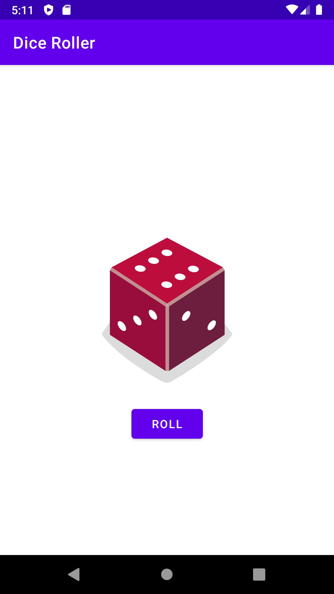

# Add a button to an app

完成 Codelab - [Add a button to an app](https://developer.android.com/courses/pathways/android-basics-kotlin-four)

練習使用類別 (classes)、物件 (objects)、以及條件式 (conditionals) 來建立互動式的擲骰子 app。

